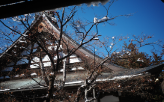
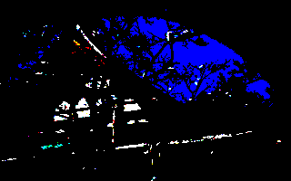
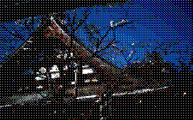
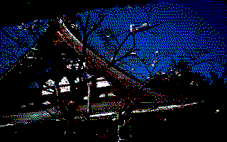
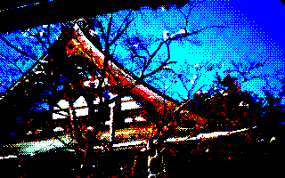

# m8acnv

m8acnvは、任意の画像を hex125(293) 氏による画像フォーマット「M8A」に変換して出力するための画像コンバータです。

## Install

```
pip install git+https://github.com/h-o-soft/m8acnv
```

## Usage

```
usage: m8acnv [-h] [-f] [-m {reduce,dither,edfs,retro}] [-g] [-p] [-s RESIZE] [-S SATURATION] [path [path ...]]

m8acnv M8A image converter Version 0.1.0 Copyright 2023 H.O SOFT Inc. / hex125(293)

positional arguments:
  path                  file path(s)

optional arguments:
  -h, --help            show this help message and exit
  -f, --force           set force write
  -m {reduce,dither,edfs,retro}, --mode {reduce,dither,edfs,retro}
                        convert mode (default = reduce)
  -g, --gamma           fixed gamma (default = disable)
  -p, --png             output png file (default = disable)
  -s RESIZE, --resize RESIZE
                        resize image (ex. 320x240) (default = disable)
  -S SATURATION, --saturation SATURATION
                        saturation (effective only in retro mode / default = None)
```

### M8A形式への変換

```
m8acnv image-file-path
```

または

```
m8acnv image-file-path output-file-path
```

パス名を1つだけ引数に指定すると、そのファイル名の拡張子を「m8a」に変更して出力します。また、明示的に出力ファイル名を渡すと、そのパスに出力します。

既に画像ファイルがある場合は上書きされませんので、上書きしたい場合はオプション「-f」をつけてください。

### リサイズ

```
m8acnv -s 320x200 image-file-path
```

`-s` オプションに (横サイズ)x(縦サイズ) を指定する事で、画像をリサイズしてから変換します。

アスペクト比に関わらず指定サイズになりますが、画像のアスペクト比は維持されます。

また、縦、横ともに8の倍数である必要があります。

### ガンマ補正

```
m8acnv -g image-file-path
```

`-g` オプションをつけると、ガンマ補正をかけて出力します。

### 減色モードの指定

```
m8acnv -m (減色モード) image-file-path
```

減色モードを指定する事で、いくつかの形式で減色したものをM8Aファイルとして出力します。

指定可能なモードは下記のとおりです。

* reduce
  * 単純な8色への変換を行います
* dither
  * 4x4の配列ディザ変換を行います
* edfs
  * 誤差拡散法での変換を行います(error diffusion / Floyd & Steinberg)
* retro
  * なんとなくレトロっぽい彩度高めのディザ変換を行います
  * デイリーポータルZの記事「[レトロPCゲームみたいな写真が撮りたい](https://dailyportalz.jp/kiji/retro_PC_game-mitaina-shashin)」の変換を参考にしています(ありがとうございます)

### 彩度の指定

```
m8acnv -S 2.0 image-file-path
```

減色モード「retro」の時のみ、画像の彩度を設定出来ます。

デフォルト値は 2.0 になります。

#### 減色の例
* 元画像
  * 
* reduce(gamma)
  * 
* dither(gamma)
  * 
* edfs(gamma)
  * 
* retro
  * 

## pngファイルの出力

通常はM8Aフォーマットのファイルのみ出力しますが、 `-p` オプションをつける事で、m8aファイルの末尾に「.png」を付与したpngファイルも同時に出力します。

変換後のイメージを事前に確認したい時にお使いください。

## 謝辞

M8Aの変換、及び、reduce、dither、edfsの変換については、 hex125(293) 氏のHSPのコードを元にして実装しました。ありがとうございます。

retro変換については斎藤公輔（NEKOPLA）氏によるImageMagickのオプションを元に実装しました。ありがとうございます。

## Author
* OGINO Hiroshi
* H.O SOFT Inc.
* twitter: @honda_ken

## License
"m8acnv" is under [MIT license](LICENSE)

